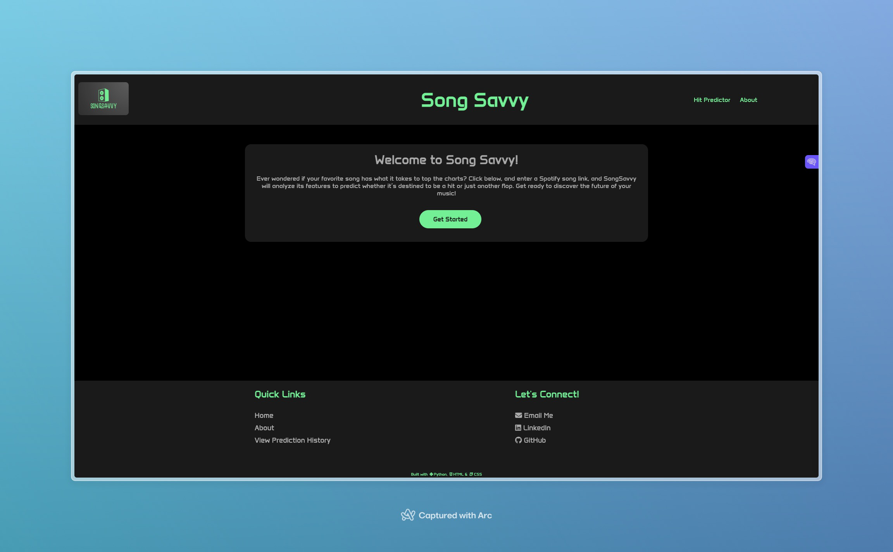
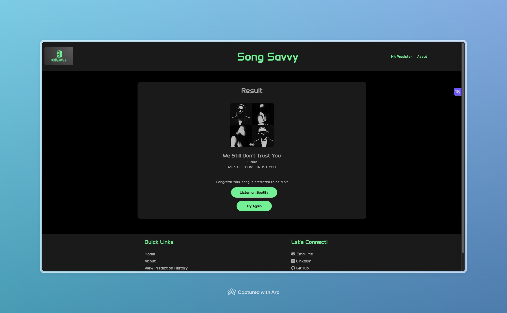

# Song Savvy

**This web application allows users to enter the link of a Spotify track and receive a prediction on whether the song will be a hit. The prediction is based on specific track information retrieved from the Spotify API and fed into a machine learning model.**

## Features

1. **ML Model**: Song savvy uses a Multi-Layered Neural Network trained on ~20000 rows of historical data. All features considered by the model is based on data that can be found in the Spotify API. 
2. **Spotify API Calls**: Song savvy makes calls to the Spotify API to retrieve the necessary track information for the requested track.
3. **Flask Web App**: Song savvy was built using Python and Flask. This allowed for creating a friendly user-interface.

## Screenshots
### Home Page

### Track Link Input Page

### Results Page (when the Track is a Hit)

## Documentation

- **Multi-Layered Perceptron Documentation** - [https://scikit-learn.org/stable/modules/generated/sklearn.neural_network.MLPClassifier.html](https://scikit-learn.org/stable/modules/generated/sklearn.neural_network.MLPClassifier.html)
- **Spotify Web API Documentation** - [https://developer.spotify.com/documentation/web-api](https://developer.spotify.com/documentation/web-api)
- **Spotipy Documentation** - [https://spotipy.readthedocs.io/en/2.24.0/](https://spotipy.readthedocs.io/en/2.24.0/)
- **Flask Documentation** - [https://flask.palletsprojects.com/en/3.0.x/](https://flask.palletsprojects.com/en/3.0.x/)

